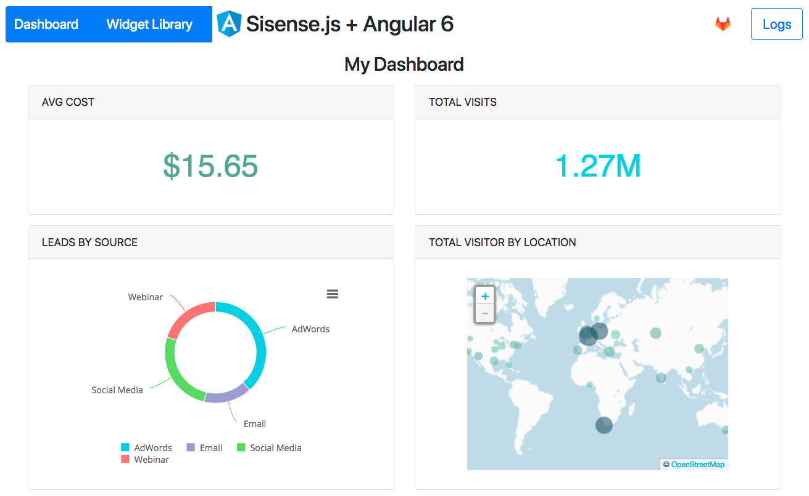
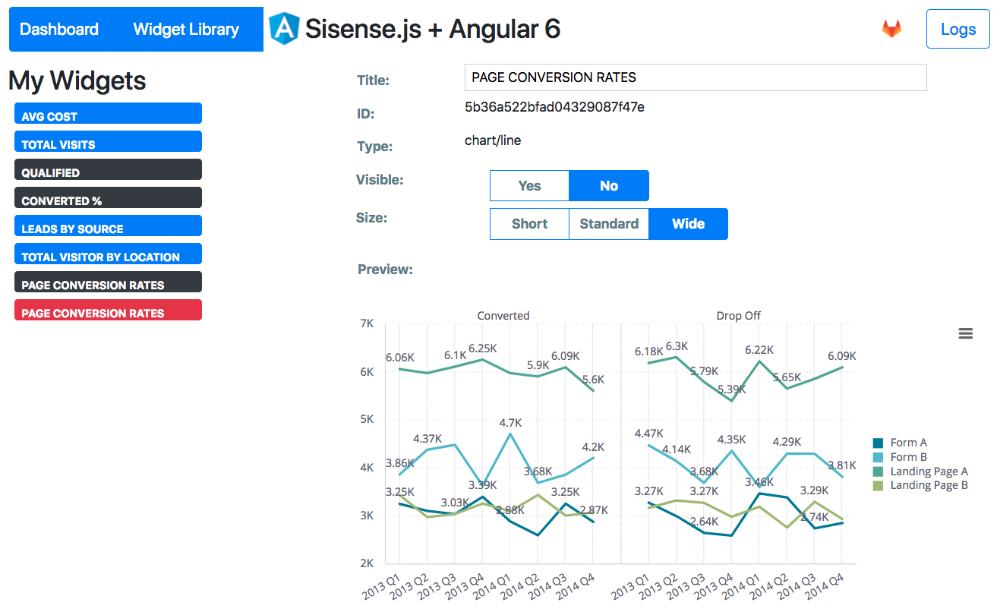

# Sisense.js Angular 6 Sample

This project was generated with [Angular CLI](https://github.com/angular/angular-cli) version 6.0.8.  The goal is to show a basic integration of Sisense.js using Angular 6.  The application consists of a dashboard as well as a widget gallery.  When you load the application, it makes some API calls to fetch all Sisense dashboards whose title are prefixed with *_gallery* and adds each widget from these dashboards to the list of available widgets.  The application will pick some default widgets to display in the dashboard, but the user can view the library to pick what widgets they want as part of their dashboard.

### Dashboard View
The application grabs 4 widgets to show by default, but the user can edit the list through the widget gallery

### Widget Gallery
The list of widgets come from your Sisense server, and the ones in blue are displayed on the dashboard. By clicking on a widget you can edit the title, size, and display setting for the dashboard.

## Configuration

In order to setup this application for your Sisense server, check out the configuration file at */src/assets/js/sisenseSettings.json*.  This file contains some settings, such as the dashboard title prefix, your Sisense server's address, etc that you may want to update before running.

## Development server

Run `ng serve` to build and run the application, then navigate to `http://localhost:4200/`. The app will automatically reload if you change any of the source files.

## Production server

Run `ng build --prod` to generate a production build out of the application.  Once built, you can deploy the web app to a web server, as per [Instructions from Angular](https://angular.io/guide/deployment)

## Further help

To get more help on the Angular CLI use `ng help` or go check out the [Angular CLI README](https://github.com/angular/angular-cli/blob/master/README.md).

For more help with Sisense.js, check out the Sisense documentation [here](https://developer.sisense.com/display/API2/SisenseJS).